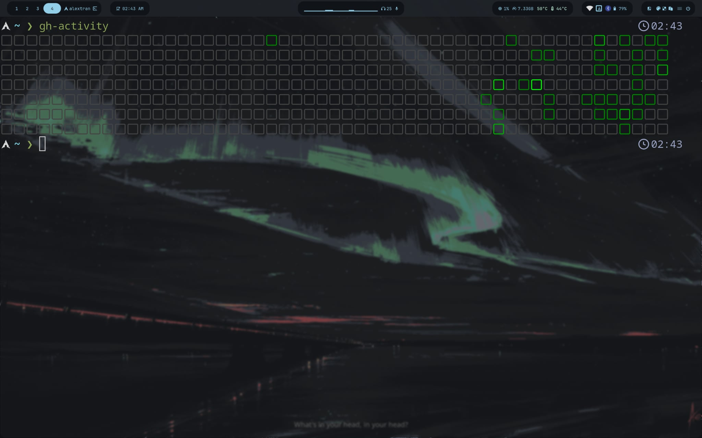

# gh-activity

A tiny zsh script that renders your GitHub contribution graph in the terminal.



## Requirements

- [`gh`](https://cli.github.com/) — the GitHub CLI, authenticated (`gh auth login`)
- [`jq`](https://jqlang.github.io/jq/) — JSON processor
- `zsh` — shell (uses zsh-specific word splitting)
- A terminal with 256-color support (most modern terminals: kitty, foot, alacritty, wezterm, etc.)

## Install

```sh
curl -o ~/.local/bin/gh-activity https://raw.githubusercontent.com/Alex-T-27/gh-activity/main/gh-activity
chmod +x ~/.local/bin/gh-activity
```

Make sure `~/.local/bin` is on your `PATH`.

## Usage

```sh
gh-activity
```

That's it. Prints the last year of your GitHub contributions as a 7-row grid of colored squares.

> Note: the username is currently hardcoded to `Alex-T-27` in the script. To use it for your own account, edit the `login:` field in the GraphQL query inside `gh-activity`. A username-as-argument version is planned.

## How it works

1. Calls the GitHub GraphQL API via `gh api graphql` to fetch the contribution calendar.
2. Uses `jq` to flatten and `transpose` the weeks-by-days matrix into 7 rows × ~53 columns.
3. Maps each contribution count to a color level (matching GitHub's 5 buckets).
4. Prints each cell as a colored Unicode square with ANSI escape codes.

## `gh-activity-img` — image version (kitty)

Some terminals (and fonts) render the Unicode square glyph inconsistently — it can show up as a blown-up emoji block instead of a neat cell. `gh-activity-img` sidesteps that by rendering the calendar as an actual PNG and displaying it inline via the [kitty graphics protocol](https://sw.kovidgoyal.net/kitty/graphics-protocol/), so it looks identical on every machine.

### Extra requirements

- [`kitty`](https://sw.kovidgoyal.net/kitty/) — terminal emulator (the binary is needed even if you don't use it as your daily driver)
- [ImageMagick](https://imagemagick.org/) — provides `magick` for rasterizing SVG → PNG

### Install

```sh
curl -o ~/.local/bin/gh-activity-img https://raw.githubusercontent.com/Alex-T-27/gh-activity/main/gh-activity-img
chmod +x ~/.local/bin/gh-activity-img
```

### Usage

```sh
gh-activity-img
```

- If you run it from inside a kitty window, the calendar is drawn inline in your current pane.
- If you run it from any other terminal (alacritty, foot, gnome-terminal, …), it spawns a kitty window with `--single-instance` — so repeated runs reuse the same kitty process instead of piling up windows — and the calendar is shown there. `--hold` keeps the window open so you can actually look at it.

### How it works (image version)

1. Fetches the contribution calendar the same way as `gh-activity`.
2. `jq` generates an SVG: one `<rect>` per day, colored with GitHub's dark-mode green palette.
3. `magick` rasterizes the SVG to `/tmp/gh-activity.png`.
4. `kitty +kitten icat` displays the PNG inline.

## License

MIT
